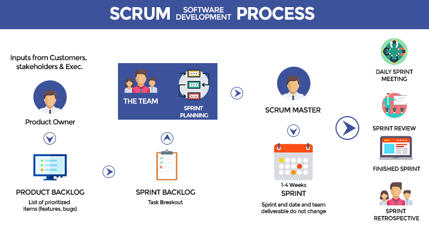

# Chapter 1

*Some popular software development methods*

1. Rapid Application Development(RAD)-1991
2. The Unified Process(UP)-1994
3. Dynamic Systems Development Method(DSDM)-1994
4. Scrum-1995
5. Crystal Clear-1996
6. Extreme Programming(XP)-1996
7. Feature-driven Development-1997

*12 Principles of Agile*

1. Our highest priority is to satisfy the customer through early and continuous delivery of valuable software.
2. Welcome changing requirements, even late in development. Agile process harness change for the customer's competitive
   advantage.
3. Deliver working software frequently, from a couple of weeks to a couple of months, with a preference to the shorter
   timescale.
4. Businesspeople and developers must work together daily throughout the project.
5. Build projects around motivated individuals. Given them the environment and support they need and trust them to get
   the job done.
6. The most efficient and effective method of conveying information to and within a development team is face-to-face
   conversion.
7. Working software is the primary measure of progress.
8. Agile processes promote sustainable development. The sponsors, developers, and users should be able to maintain a
   constant pace indefinitely.
9. Continuous attention to technical excellence and good design enhances agility.
10. Simplicity - the art of maximising the amount of work not done - is essential.
11. The best architectures, requirements, and designs emerge from self-organising teams.
12. At regular intervals, the team reflects on how to become more effective, then tunes and adjusts its behavior
    accordingly.

*SCRUM*

A set of practices used in agile project management that emphasise daily communication and the flexible reassessment of
plans that are carried out in short, iterative phase of work.

*SCRUM Process*

*SCRUM Roles*

- Product Owner: The product owner speaks for the end users, the customers, and the business needs.
- Development Team: The development team carries out the work.
- Scrum master: The project manager.
- Stakeholders: Anyone who is affected by the project outcomes.
- Agile Mentor: Someone experienced in delivering Agile projects.

*The Artefacts*

- Product Backlog: The full catalogue of requirements. At the detailed level these requirements are written in the form
  of user stories.
- Sprint Backlog: The list of user stories assigned to the current Sprint, selected during Sprint Planning.
- Product Increment: Sufficient usable functionality to ship/implement for use. It may take several sprints to achieve
  enough cohesive, fully tested content to be appropriate for release to the end user.

*The Events*

- Sprint: Agile team for iteration. Sprints are short cycles, usually no longer than 4 weeks and typically 1-2 week,
  thus providing the opportunity for continual improvement. The aim of the sprint is to achieve shippable functionality.
- Sprint Planning: A meeting which takes place at the beginning of each sprint cycle to prioritise the user stories in
  the Product Backlog.
- Daily Scrum: A daily stand-up meeting to assess progress, adjust plan and discuss blocker.
- Sprint Review: A meeting which takes place at the end of each sprint cycle with the development team, product owner
  and the users/stakeholder.
- Sprint Retrospective: A meeting which takes place at the end of each sprint cycle with the internal scrum time in
  which they discuss what well during the sprint and what needs to improve.