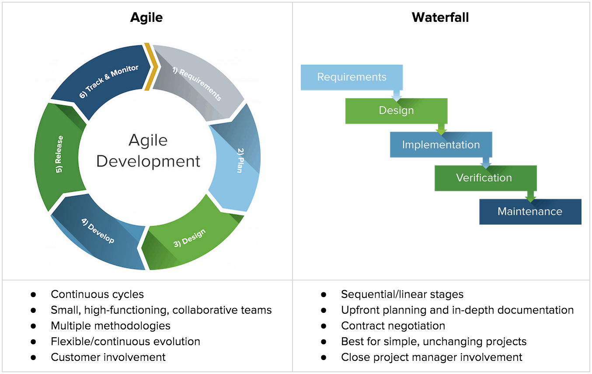

# Chapter 2

*The Waterfall project cycle*

1. Planning/Requirements gathering
    - The project manager sets out:
        - The key deliverable
        - The requirements
        - The plan.
        - The roles
        - The benefits
2. Design
    - During the design stage, the team identifies and writes the detailed documentation in the form of artefacts. It
      includes:
        - Detailed requirements
        - System design
        - Communication Plan
        - Governance framework
        - Delivery plan
        - Financial forecast
        - RAID(D) log-(Risks, Assumptions,Issues,Dependencies,(Decision))
    - The requirement and design documents is very important as it determines the success or failure.
3. Implementation/Build
    - At this stage, the team complete the work using documentation produced in the Design phase.There should be no
      reason to revisit the outputs from the Design phase because system design/requirements documents are perfect!.
4. Testing.
    - Primarily User Acceptance Testing, carried out by specialist tester or representatives of the end user base. Any
      element of the product does not match the original design/requirements is defect and sent back for re-work.
5. Delivery/Maintenance
    - At this last stage, the project delivers to the end user/customers and post live support. 

